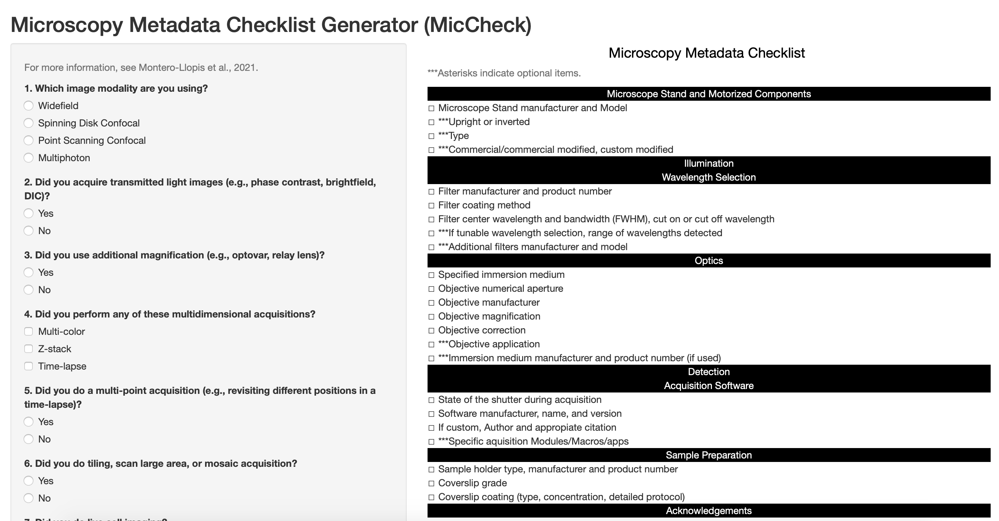
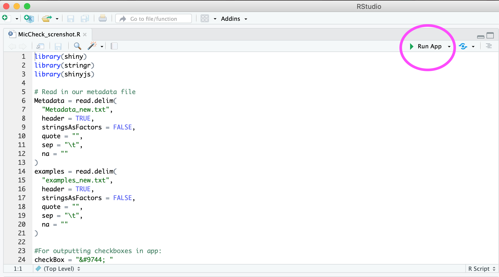
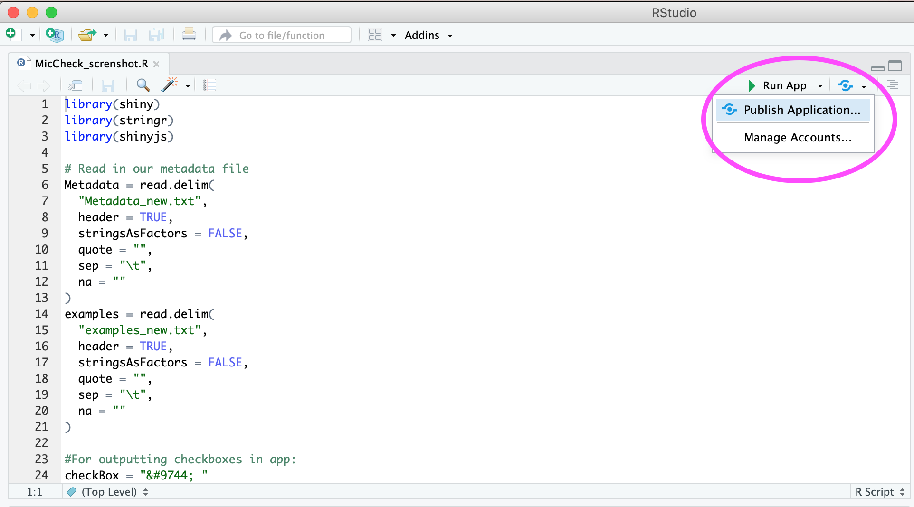

# MicCheck
Microscopy Metadata Checklist Generator in Shiny

    

## To add your own metadata examples:
1. Download all files to your computer (make sure you have R and RStudio installed)
2. Open metadata_new.txt and examples_new.txt in excel
3. Each metadata cell has a corresponding example cell
4. Just change the text in the examples_new.txt file to your own personal examples. If you'd like to remove an example, place a " " blank space in the cell to preserve ordering of the examples
5. Tip: avoid special characters as Shiny.io requires pdflatex and doesn't play well with special unicode characters such as the symbol for "mu"
6. To run from RStudio, open the MicCheck.R file and hit the Run App button

    

7. To upload your own version to Shiny.io, make an account and from RStudio select "Publish Application..."

    

