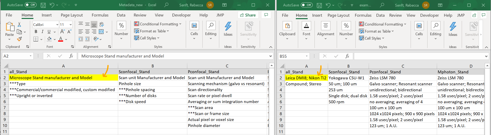

# MicCheck
Microscopy Metadata Checklist Generator in Shiny

## To use MicCheck, follow [this link](https://rebecca-senft.shinyapps.io/MicCheck/).

Reference article:
Montero Llopis, P., Senft, R. A., Ross-elliott, T. J., Stephansky, R., Keeley, D. P., Koshar, P., Marqués, G., Gao, Y., Carlson, B. R., Pengo, T., Sanders, M. A., Cameron, L. A., & Itano, M. S. (2021). Best practices and tools for reporting reproducible fluorescence microscopy methods. Nature Methods, 18(12), 1463-1476. https://doi.org/10.1038/s41592-021-01156-w

    

## To add your own metadata examples:
1. Download all files to your computer (make sure you have [R](https://cran.rstudio.com/) and [RStudio](https://rstudio.com/products/rstudio/download/) installed)
2. Open metadata_new.txt and examples_new.txt in excel
3. Each metadata cell has a corresponding example cell

    

4. Just change the text in the examples_new.txt file to your own personal examples. If you'd like to remove an example, place "NA, "N/A", "None" or a " " blank space in the cell to preserve ordering of the examples
5. Tip: avoid special characters as Shiny.io requires pdflatex and doesn't play well with special unicode characters such as the symbol for "mu"
    * The current R shiny app can deal with base letters, "#", "%", "/", and "^" characters. Others may trigger special meanings when compiled into pdfs with latex but should still display correctly online.
6. To run MicCheck from RStudio, open the MicCheck.R file and hit the Run App button

    

7. To upload your own version to Shiny.io, make an account and from RStudio select "Publish Application..."

    

This app wouldn't be possible with Shiny and several other amazing R packages (stringr, shinyjs, pander, and rmarkdown). Citations below: 

Winston Chang, Joe Cheng, JJ Allaire, Yihui Xie and Jonathan McPherson (2020). shiny: Web Application. Framework for R. R package version 1.5.0. https://CRAN.R-project.org/package=shiny

Hadley Wickham (2019). stringr: Simple, Consistent Wrappers for Common String Operations. R package version. 1.4.0. https://CRAN.R-project.org/package=stringr

Dean Attali (2020). shinyjs: Easily Improve the User Experience of Your Shiny Apps in Seconds. R package. version 2.0.0. https://CRAN.R-project.org/package=shinyjs

JJ Allaire and Yihui Xie and Jonathan McPherson and Javier Luraschi and Kevin Ushey and Aron Atkins and Hadley Wickham and Joe Cheng and Winston Chang and Richard Iannone (2020). rmarkdown: Dynamic Documents for R. R package version 2.6. URL https://rmarkdown.rstudio.com.

Gergely Daróczi and Roman Tsegelskyi (2018). pander: An R 'Pandoc' Writer. R package version 0.6.3. https://CRAN.R-project.org/package=pander
